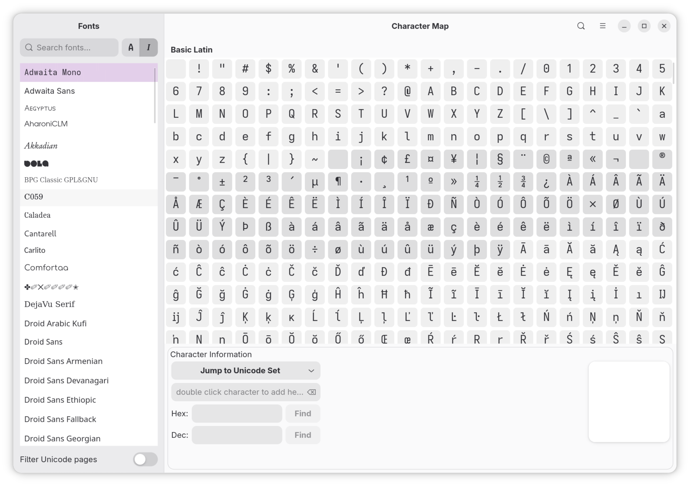
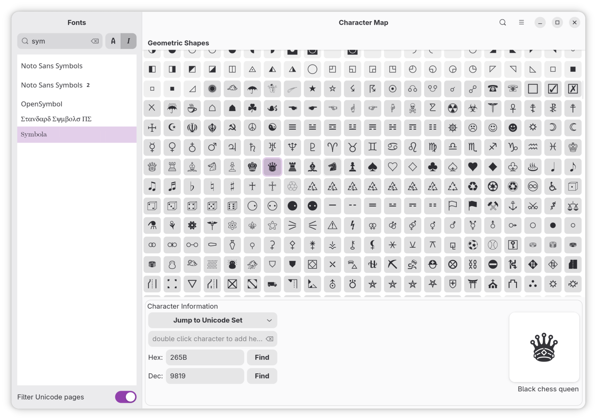
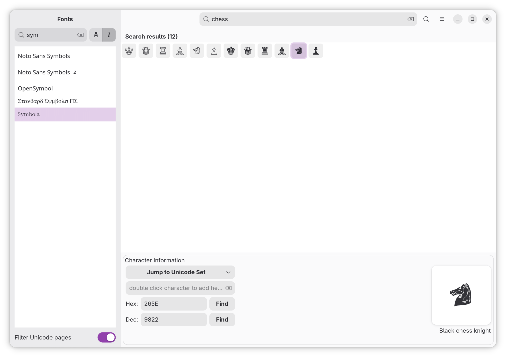
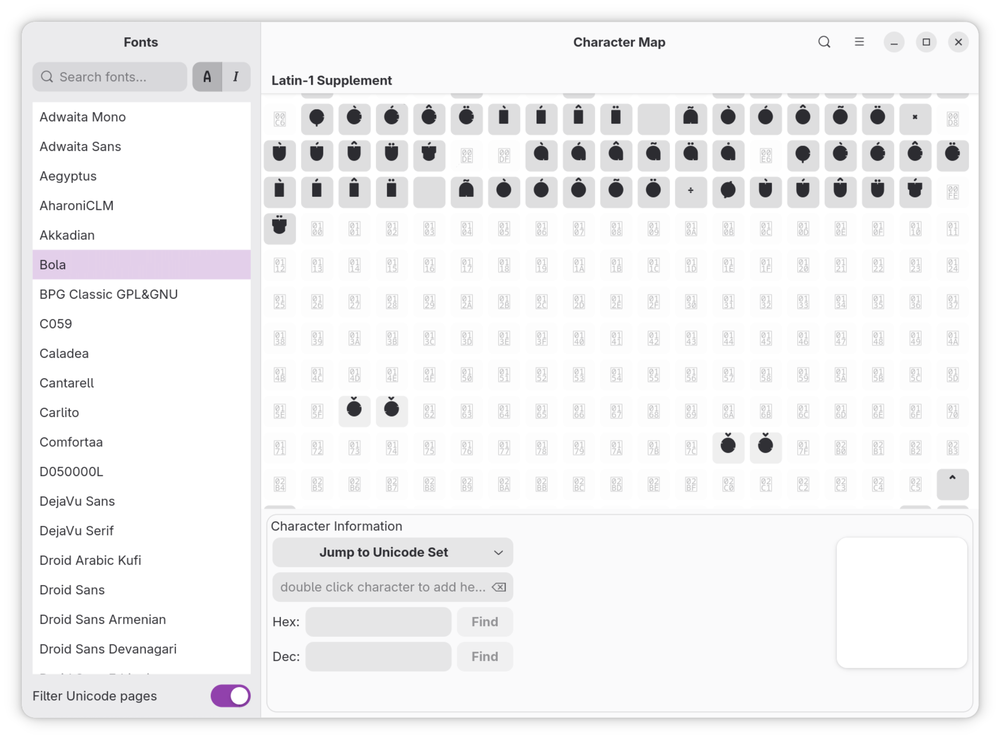

# Character Map for Linux

Character Map is a very useful utility to go through the font and see all available characters.

A character map / special characters viewer for Linux.

## Features

- Browse installed fonts and see which Unicode blocks each one supports
- Filter Unicode blocks to only those a font actually covers
- Browse characters in a virtualized grid, grouped by Unicode block
- Search characters by name, hex, or decimal code
- Jump straight to a Unicode block
- Preview characters large, in the selected font
- Collect and copy characters to the clipboard

## Screenshots





_Filter font names_



_Search by character name_



_Unsupported glyphs have different background and foreground color to distinguish between supported and non-presented glyphs._

## Installation sources
<a href="https://github.com/XRayAdams/charactermap/releases">

</a>

### From Snap Store

[](https://snapcraft.io/charactermap)

### AUR manual installation

1. Download the latest `.pkg.tar.zst` package from the project's GitHub releases page.
2. Open a terminal and navigate to the directory where you downloaded the file.
3. Install the package using the following command:

   ```bash
   sudo pacman -U [name-of-the-package].pkg.tar.zst
   ```

Replace `[name-of-the-package].pkg.tar.zst` with the actual file name.

### DEB manual installation

1. Download the latest `.deb` package from the project's GitHub releases page.
2. Open a terminal and navigate to the directory where you downloaded the file.
3. Install the package using the following command:

   ```bash
   sudo apt install [name-of-the-package].deb
   ```

### RPM (Manual Installation)

1. Download the latest `.rpm` package from the project's GitHub releases page or your distribution's package repository.
2. Open a terminal and navigate to the directory where you downloaded the file.
3. Install the package using the following command:

    ```bash
    sudo dnf install [name-of-the-package].rpm
    # or, for openSUSE:
    sudo zypper install [name-of-the-package].rpm
    # or, for older systems:
    sudo rpm -i [name-of-the-package].rpm
    ```

Replace `[name-of-the-package].rpm` with the actual file name.

